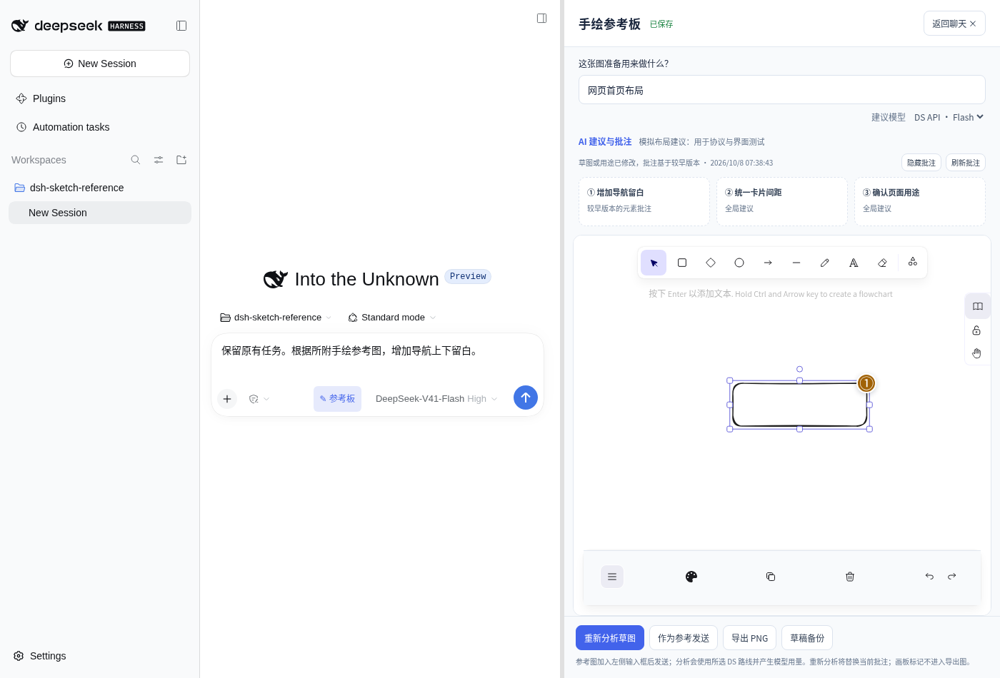

# AI 锚点批注与混合输入

本轮在 0.1.0 上增量开发为 0.2.0，保持 DSH 0.2.1-alpha.1、Excalidraw 0.18.1 和原有依赖。定位仍是 DSH 特化的可视化需求交互：原生 Agent 获取参考图和用户确认的指令；批注是增强能力，不是发送参考图的前置条件。

## 分工与输入

默认分析提供三类信息：PNG、用户用途、受限元素 JSON。DeepSeek 负责语义理解、建议和目标关联；插件负责校验真实 ID、坐标转换、移动跟随、失去锚点、会话身份和持久化。没有新 AI API、代理或密钥配置，没有自动分析、轮询或工具执行。

结构描述只提取 `id/type/x/y/width/height/angle` 和文本元素的 `text`，不发送完整 appState、customData、其他会话或主聊天记录。列表最多 200 元素、48KiB，文字最多 160 个码点。截断时告诉模型总数及截断状态；只允许绑定实际提供的 ID。自由手绘也可绑定稳定元素 ID。元素数量过多或草图极端宽长时，建议拆分后分析。

模型返回保持原有语义，新增可选字段：

```json
{
  "summary": "首页布局的建议",
  "suggestions": [{
    "kind": "improve",
    "title": "增加导航留白",
    "reason": "导航内容偏挤",
    "actionPrompt": "根据所附手绘参考图，增加导航上下留白。",
    "anchor": {"type": "element", "elementId": "本次元素列表中的真实ID"}
  }]
}
```

Zod 校验建议内容；锚点再校验结构与 ID 成员关系。无效、未知、已删除、未提供的 ID，以及坐标等当前未支持的锚点，均移除锚点而保留合法文字建议；不猜测替代元素。JSON、建议字段或正常终止条件不合格时整次请求失败，不制造新结果，保留原草图及此前真实结果。

目前未增加临时分析图编号，也未开放区域坐标锚点。PNG 是原场景的导出图，元素 ID 关联能力仍需真实 DS 对照评测；这些可选增强应在测量必要性后单独增加。

## 定位与交互

使用 Excalidraw 公开 `getCommonBounds()` 获取当前目标的边界，`sceneCoordsToViewportCoords()` 转换到视口，再换算到覆盖层容器。订阅公开的 `onChange/onScrollChange`，结合 ResizeObserver 和 animation frame 更新。当提示或卡片改变画板布局时，通过公开 `refresh()` 更新 Excalidraw 的视口偏移。编号按钮与详情卡片为 HTML 覆盖层，整层穿透鼠标，只有编号及详情接收交互；不修改正式元素和 PNG。

列表与编号共享选中批注，点击列表使用 `scrollToContent()` 定位，以 `CaptureUpdateAction.NEVER` 更新原生选中高亮。解决、重开、忽略和显示开关不会调用模型，也不进入绘图撤销历史。已解决弱化；已忽略隐藏，可通过“显示已忽略”重新打开。目标被删除时隐藏定位标记并显示“失去锚点”，撤销删除后可再次找到相同 ID。

草图或用途变化后继续比较内容摘要和用途，禁用旧“使用建议”；重开画板同样检查过期状态。平移、缩放、选中和批注状态不改变场景摘要。过期判断仅在真实草稿变化时执行，避免 Excalidraw 重绘与 React 状态更新反复触发计算。

## 持久化与兼容

沿用 `sketch_reference` 的 drawings 和 advice 表，存储域仍为版本 0。drawing 格式、revision、mutationId 和本地恢复不变；advice 记录添加可选字段：

| 字段 | 含义 |
| --- | --- |
| `analysisRevision` | 分析开始时固定的已保存 drawing revision |
| `contentDigest` / `goal` | 仍用于过期和原生指令桥验证 |
| `inputMode` | image、structure 或 hybrid；编辑器默认 hybrid |
| `comments[]` | `id/suggestionIndex/status/createdAt`；状态 open、resolved、ignored |
| `commentRevision` | 批注状态自己的 CAS 版本 |
| `commentMutation` | 最近一次状态请求，支持响应丢失后的幂等重试 |

每个 comment 的文字、actionPrompt 和锚点通过 `suggestionIndex` 引用同一条不可变的 `advice.suggestions[]`，避免两份建议不同步。batch 自身保存 owner 和时间。会话键仍包含 sessionId、createdAt、cwd。状态更新检查 batchId 与 commentRevision；另一窗口更新后要求刷新；重分析替换批次后拒绝旧批注请求。绘图 CAS 与批注 CAS 互不混用。写入失败不乐观地显示成功；重试复用 mutationId，或刷新获取服务器状态。

旧 0.1.0 记录不含新字段，仍通过新 schema。读取时生成稳定的批注 ID 和初始 open 状态，不改写原记录，也不伪造旧分析的 drawing revision；首次状态操作才补入元数据。没有删除或整体迁移旧草稿。新记录写入后，旧 0.1.0 严格 schema 无法识别新 advice 字段，因此**不支持原数据目录直接降级**；升级前应退出宿主并备份完整宿主数据。需要回退时使用升级前的数据备份，保留升级后的数据目录。仅备份插件 profile 配置并不足以备份底层存储。不要手工删除 advice 字段或覆盖存储文件。

空 `boundElements: null` 与 `[]` 在 Excalidraw 重开时会互换，本版统一为空 null 表示并在内容摘要中等同处理，真实绑定仍参与摘要。未主动重算全部旧数据；旧记录若曾用空数组计算摘要，后续保存可能保守地将旧建议标为过期，需要重新分析，不会错误启用旧指令。

分析复用 `resolveModelInfo/attachments.saveImage/llm.stream`，保留取消、正常结束、90 秒默认超时（可配置）、2 个全局并发及每会话每分钟 6 次限制。模型上游超时返回 HTTP 504，避免 Chromium 对 408 自动重发 POST 造成重复分析。分析完成前再次检查会话和 drawing revision；期间服务器草图改变则丢弃本次结果。模型失败不影响绘图、保存、导出与原生参考附件；原生附件仍遵循宿主模型能力约束。

## 自动与浏览器验证

执行 `pnpm run typecheck`、`pnpm test`、`pnpm run bundle` 和 `pnpm pack`。一般浏览器回归见 `docs/validation.md`。

批注浏览器测试只在专用 profile 执行：以官方 web 模板初始化，安装本地构建包，将 `tests/browse-picker.overlay.yml`、`tests/mock-model.overlay.yml` 与 `fixtures/mock-sketch-model.mjs` 复制到隔离 profile 内并保持相对结构，再启动宿主（避免 overlay 改变客户端模块解析基址）。后者将 `llm.stream` 替换为固定模拟返回，并将超时设为 10 秒；禁止在日常或真实模型 profile 启用，禁止把模拟建议作为比赛模型效果证据。测试文件不包含在安装包中，也没有生产 mock 开关。

```sh
dsh --profile sketch-test --from-default-profile web --dump-config > /临时目录/profile-config.yml
dsh plugin --profile sketch-test add /绝对路径/dsh-sketch-reference-0.2.1.tgz
dsh --profile sketch-test --patch /隔离profile/sketch-tests/browse-picker.overlay.yml --patch /隔离profile/sketch-tests/mock-model.overlay.yml --no-open
# 将宿主输出的登录地址置于 DSH_SMOKE_URL，不提交该地址
pnpm run test:browser:comments
```

脚本通过固定版本客户端服务显式创建测试会话：DSH 的普通“新建会话”会复用尚未发送聊天的空白会话，草图本身不会改变该宿主语义。测试使用 React 18 的 fixture 只读取公开 Excalidraw API，并调用固定版客户端会话服务；生产代码不暴露测试全局变量。

以下是实际 DSH/Excalidraw 界面、**模拟模型响应**的测试截图：编号跟随当前元素，旧草图建议显示过期；不代表真实 DeepSeek 定位效果。



## 三种输入模式与真实对比

三种模式共享同一个场景版本、用途、模型、Prompt 与输出约束。默认 UI 始终使用 hybrid；image/structure 仅供显式 RPC 对比脚本使用。image 只向模型传 PNG 和用途；structure 只传元素数据和用途，不注册模型图片附件；hybrid 同时提供两者。结构测试只能证明这些通道和校验正常，不能证明模型理解更好。

在**没有模拟插件**、已配置有效 DS 的独立 profile 中准备草图和用途，从画板 iframe 的 URL 中读取 `sessionId`，放入 `DSH_COMPARE_SESSION_ID`，然后运行（脚本会独立打开该已保存会话，避免宿主导航误选）：

```sh
# DSH_SMOKE_URL 为该专用宿主的登录地址，DSH_COMPARE_REAL=1 显式开启模型调用
DSH_COMPARE_SESSION_ID=待验收会话ID DSH_COMPARE_REAL=1 pnpm run test:model-comparison
```

脚本通过既有 DSH RPC 调用三次真实配置路线（可能产生用量，并替换该测试会话的最近建议），将原始建议、模式、耗时、场景摘要和人工评分占位保存到被忽略的 `test-results/model-comparison-*.json`。可设置 `DSH_COMPARE_PROVIDER=deepseek-account` 或 `deepseek-official`，仍无需新增密钥。检测到已知模拟建议时记录失败，不作为真实证据。运行前应由操作者确认宿主未装其他模拟模型，并用日志/用量记录验证实际调用。

至少选 5 类草图：导航/侧栏/卡片布局、中文标注、自由手绘、信息稀疏、结构密集。人工提前记录希望识别的问题及对应元素 ID，再盲评每条建议：用途理解（1～5）、语义目标是否正确、合法锚点是否指向正确目标、建议可执行性（1～5）、无关/虚构内容和耗时。分别记录锚点覆盖率及正确率，不能把 ID 合法等同于语义准确。

纯图片模式没有真实元素 ID，因此无法自动生成可校验的元素锚点，定位退化为全局建议。这是信息与协议差异，**不能仅以该模式锚点覆盖率为 0 宣称模型理解差**；其语义目标应由人工从文字建议单独评判。三模式至少重复 3 次，使用新测试会话或间隔满足现有每分钟 6 次限制；报告原始结果及失败，不提前写改善百分比。

当前环境没有有效 DS 凭据，**真实三模式定位准确率、建议质量与最终 Agent 任务效果未验收**。

## 手动验收

1. 在配置有效 DS 的 DSH 会话画导航、侧栏、卡片并写用途；主动分析一次，核对摘要、建议与真实元素 ID 是否合理。
2. 点击编号/列表，检查详情、选中高亮、收起；移动、调整尺寸、平移、缩放、改变分栏与窗口大小，核对标记跟随。旋转和复杂绑定图形需要额外实机检查。
3. 解决、关闭重开、重新打开、忽略、显示已忽略后重开；切换会话检查隔离。两窗口修改同一状态，检查冲突刷新与重试。
4. 删除目标应失去锚点，撤销恢复同一 ID；修改草图/用途应使旧指令禁用；重开仍过期。重新分析产生新批次，旧状态请求不能应用到新批次。
5. 主输入已有文字与附件时使用建议、加入参考 PNG，确认保留原输入且不自动发送、不切模型。导出图和草稿不得含批注文字/编号。
6. 模型不可用、取消、超时或无效输出后，继续绘图、保存、导出并加入参考附件；检查宿主日志无额外分析调用。
