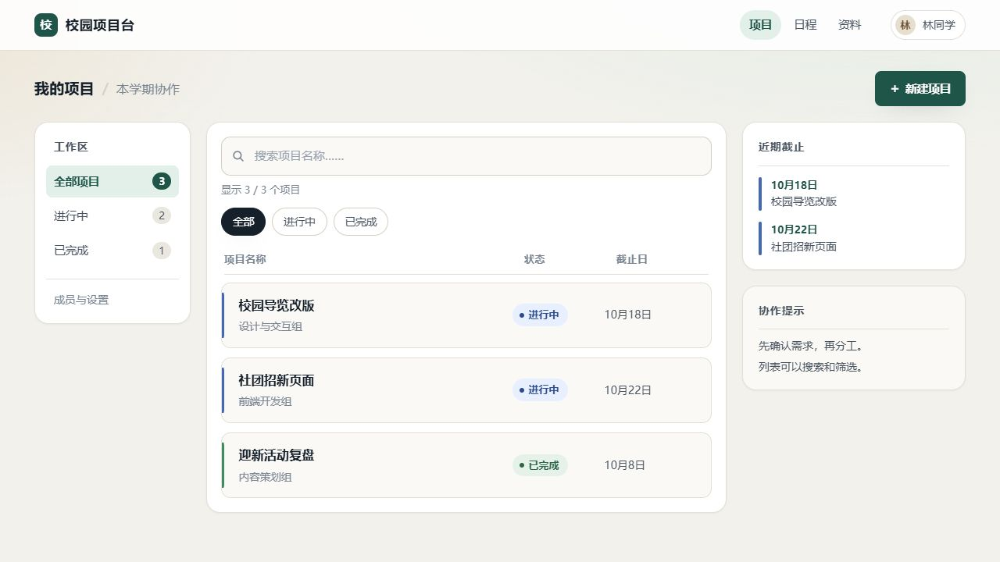
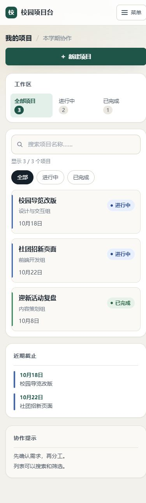

# 前端辅助能力实机验证（2026-10-09）

结论：在本次校园项目台案例中，绘板成功传递了布局和文字，DS 能据此生成可用的响应式网页原型。首次交付存在遮挡整页的弹窗错误；一次具体反馈后由 DS 自行修复，搜索、筛选、新建和移动菜单通过实机操作。视觉整洁、层级清楚，但偏常规，仍有键盘可访问性、文字对比度和意外筛选问题，不能认定达到生产交付质量。

这是一个案例的定性评价，不是模型通用能力评分，也不证明绘板相较纯文字提示提高了成功率。PPT 排版、可编辑 PPTX、复杂页面、真实设备软键盘及完整插件验收矩阵未在本轮测试。

## 条件与方法

- 插件：本地 v0.3.2 候选 `c86a0bc`；运行包 SHA256 `2EDEC8BA948F65014BC6E77082FDEDDD7A30959FDD0E4DABCB78237C9253D4F0`。本轮没有改动插件运行代码。
- 宿主：Windows 本地 DSH，界面显示 `DeepSeek-V41-Flash · High`，用户已配置官方模型路线。
- 输入：26 元素黑白线框，包含顶栏、左侧工作区、中间三条项目行、右侧近期截止与协作提示；全部为虚构测试文字。制作前先明确搜索、状态筛选、新建、空结果和手机适配标准。
- 模型实际读取已保存的 summary、elements 和对应 revision 的视觉参考；没有向模型提供现成网页。Codex 只制作夹具、反馈缺陷和操作浏览器，没有替模型编写或修复成品。
- DS 只在 `test-results/frontend032/generated/` 写入原生 HTML/CSS/JS。检查前 Git 工作区无跟踪改动，完成后仅添加此报告与证据图片。
- 复用了此前自建的未发送性能测试草稿，先备份其 250 元素及 owner，并限制覆盖到该明确测试会话。其他草稿不在覆盖范围。
- 计费约定按界面发起次数：本轮 #26、#27 共 2 次，30 次授权累计 **27/30，剩余 3 次**。两轮 Agent 内部合计 32 步，另观察到一次宿主自动重试。界面 token 累计包含缓存，不能据此推算实际费用。

## 首次交付与修复

首次成品的 `#modal.hidden=true`，计算样式仍为 `display:grid`，进入页面即出现遮罩，取消不能关闭。DS 的静态和逻辑检查没有发现该问题；它尝试运行的浏览器检查受环境阻挡，未被计作通过。Codex 使用已经连接的浏览器独立验证，无需扩大执行权限。

#27 反馈明确指出这一浏览器现象。DS 在 CSS 基础层添加 `[hidden] { display: none !important; }`，同时修复其他使用 hidden 的控件。复测初始弹窗为 `display:none`，开启、取消、Escape 均正常。保留首次交付副本，不把修复后的结果记为首次成功。

## 复测结果

| 检查 | 观测 |
| --- | --- |
| 布局与内容 | 顶栏、左栏、中央水平项目行及右栏均保留；三个项目、小组、状态及日期含义正确。 |
| 搜索与清空 | “社团”命中一项；不存在的词显示明确空结果；清空恢复三项。 |
| 状态与组合筛选 | “已完成”命中一项，左栏与中央筛选同步；“已完成+社团”显示组合条件空结果，重置恢复。 |
| 新建 | 空名称提示错误并聚焦；新建“界面验证项目”后共四项，状态计数 4/3/1，截止列表按日期更新；提示成功并关闭弹窗。 |
| 取消与 Escape | 不创建记录，关闭后焦点回到新建按钮。 |
| 手机操作 | 390×844 下菜单可展开/折叠，搜索可用；弹窗完整处于视口内。 |
| 响应式 | 1440×900 三栏；768×900 辅助栏下移；390×844、320×740 单列。各尺寸 DOM 边界检查及截图未见横向溢出。属于浏览器视口模拟，不等同于真实手机。 |
| 控制台 | 本轮读取的警告及错误日志为空。 |
| 草图保护 | 生成前后 revision 均为 `0846cc1c-3418-46fc-a7dc-753af1375947`，仍为 26 元素；代理记录只有夹具的一次 drawing/save，没有分析、批注或提案写入请求。 |

桌面实机截图：

手机视口完整截图：

## 尚存问题与边界

| 优先级 | 问题、证据与建议 |
| --- | --- |
| P1 | 弹窗焦点未约束。聚焦“创建项目”后按 Tab，焦点移出弹窗，下一次落到背景的跳转链接。应约束 Tab 循环并使背景不可交互；现有 Escape 和关闭后的焦点恢复可以保留。对应 `app.js` 的模态框及 keydown 处理。 |
| P1 | 辅助文字对比不足。依据实际计算颜色：小组文字 3.56:1，计数/表头 3.75:1，搜索占位文字 2.40:1；均为普通尺寸文字，未达到本轮采用的 4.5:1 审查门槛。弱面包屑对底色约 3.31:1，背景渐变会使局部值略有不同。应加深共享 muted 色及占位色。 |
| P2 | 普通项目行误触发筛选。点击“迎新活动复盘”标题，三项列表变为一项且“已完成”被选中。原因是 `app.js:402` 的全局 `[data-status]` 事件委托也命中项目行及状态装饰节点。应把匹配范围限定到筛选按钮。 |
| P2 | 主页面缺少 h1；必填错误为视觉提示，未关联 aria-invalid / aria-describedby。应补充语义和可读错误关联。 |
| 范围边界 | 顶栏日程、资料、成员设置是占位链接；新建数据只保存在内存，刷新恢复三个初始项目。这些不是本轮要求的完整产品功能，不计作已完成的导航或持久化能力。 |

从使用价值看，绘板适合辅助表达网页的区域关系、内容和改动意图；本例能够推进到可操作原型。成品视觉是常规后台风格，圆角面板、状态徽章和间距较一致，尚不足以证明强品牌设计或高水平原创视觉能力。数学样例中的推导失败不能直接推断这一场景失败，反之本例通过也不抵消数学验收失败。

## 可复核产物

本地预览 `http://127.0.0.1:57324/`，也可直接打开 `test-results/frontend032/generated/index.html`。测试服务仅监听本机；主 DSH 57317 保持运行。测试代理 57325 在记录完成后关闭。

本地忽略目录 `test-results/frontend032/` 保存 wireframe.png、submitted-first/、generated/、first-render-bug.json、browser-results.json、drawing-after.json、ds26-trace.txt、ds27-trace.txt、不同视口截图及旧草稿备份；不将模型思考或宿主私有日志作为公开报告内容。

最终成品 SHA256：

| 文件 | SHA256 |
| --- | --- |
| index.html | EF1DBD5E2BB60415009128B2AAD9FC360D6700DD816F05A8F94C2BE34E5C4BCA |
| styles.css | C486A78935257E7AAE56AA26B5EE14C4490EA6CFC37DB358703AA0C871D1EAE9 |
| app.js | 325D49E9982801BD2D527F44A3C550AD96648D829D578347375E24F76D0CC929 |

本轮只新增评估文档和截图，没有修改插件源码，未重复运行此前已通过的 135 项插件测试。历史缺口继续以 [DS30 报告](windows-validation-v0.3.2-ds30-20261009.md) 为准，不宣称插件全部验收完成。
