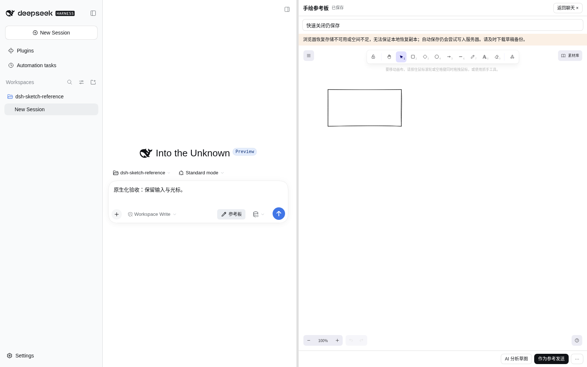
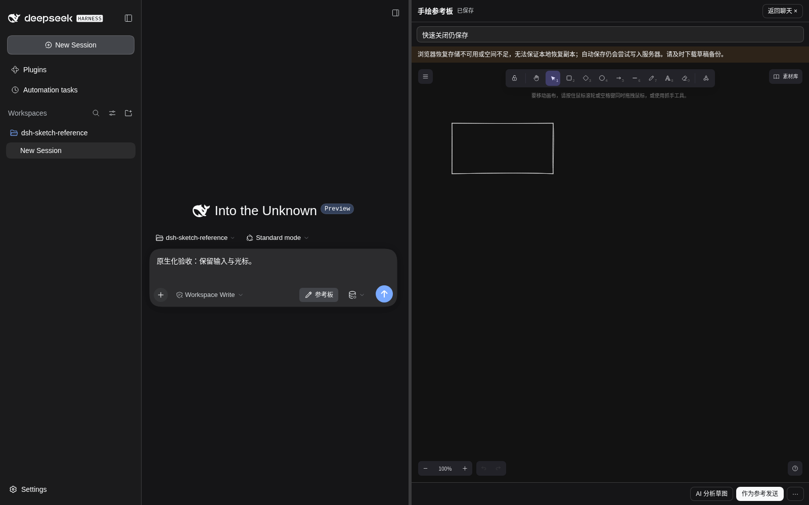

# 0.2.1 原生集成与性能验收

日期：2026-10-08。固定 DSH `0.2.1-alpha.1`、Excalidraw `0.18.1`；增量开发，无新增依赖、外部模型 API、密钥要求或存储迁移。核心仍是 DSH 会话内的可视化需求输入，分析与批注可选。

## 审计结论与实施顺序

| 优先级 | 实际问题 | 改动与收益 |
| --- | --- | --- |
| P0 | 工具栏关闭直接卸载 iframe，绕过保存/冲突保护 | 与「返回聊天」走同一个保存后关闭流程；保存失败留在画板 |
| P0 | 会话切换移除 iframe，React 清理不能保证执行，普通 fetch 可被浏览器取消 | `pagehide` 固定最新快照、取消分析、尝试末次保存；小保存使用受限 keepalive；保留本地恢复 |
| P0 | 全局面板状态、定时握手、重连后旧任务可能向新 port 回答 | 每次插件 apply 独立 observable；公开 Slot hooks；事件握手、文档 instanceId、独立 AbortController 和捕获的回复端口；释放等待任务/计时器 |
| P0 | 动态加载的原生页头扩展未被映射 | 订阅公开 Slot registry 变更，增量注册/释放，保留原生 inject/store/locale |
| P0 | 图片与最新服务端版本可能不同 | 原生附件加入前校验 sceneDigest；重复附件不再重复查询模型能力 |
| P1 | 每次绘图/视口回调深拷贝和校验场景；每帧写恢复副本 | 元素引用/版本和保留网格字段快速比较；真实编辑最多合并 80ms；显式动作同步 flush；缓存 autosave canonical；状态不变不通知 React |
| P1 | 无宿主主题同步、固定浅色、提示占较多画布 | 可选公开 theme 服务和 theme/change；受限主题消息；Excalidraw theme prop；DSH Button 与主题 CSS token；紧凑布局和折叠列表 |
| P1 | 相同快照重复 PNG 渲染 | 单个不可变场景快照的 PNG Promise 缓存，失败可重试，换图即替换；不缓存 AI 结果 |
| P2 | 空白加载、导出无状态、布局变化后画板偏移滞后 | 加载/导出状态；App chunk 失败保留可关闭桥接；ResizeObserver + 公开 refresh；关闭清理 observer/事件/样式 |

`src/client/appearance.ts`、`panel-store.ts`、`SketchShell.tsx`/`SketchFrame.tsx`、`header-adapter.tsx`负责宿主连接与 UI。`src/core/appearance.ts`负责受限主题契约，`limits.ts`集中 keepalive 上限。`src/editor/scene-updates.ts`、`autosave.ts`、`scene-export.ts`负责快照与缓存；`App.tsx`、`appearance.ts`、`bridge.ts`、`rpc.ts`、样式和加载入口负责交互。构建 CSS 模块改为按 Cordis effect 生命周期挂载/释放。对应新增 lifecycle/bridge 单元测试与 native/performance 浏览器脚本，更新原有浏览器选择器。

## 原生接口与保留的兼容层

- 宿主继续以 Cordis Service/init/effect、storageDomain 和会话生命周期检查运行；无新增后台任务或轮询。
- 客户端入口使用 `conversation.input.right`、原生 Button；面板 observable 通过 Slot 注入 hooks，公开会话列表/生命周期驱动清理。工作目录变化重建 iframe；RPC 继续校验 sessionId、createdAt、cwd。
- 聊天区域仍用官方 `conversation.content` 工厂，保留原输入、附件和业务动作。不会自动发送、切换模型或为绘图/主题/批注状态变化触发分析。
- 可选 `ctx.get('theme').getTheme()` 和 `theme/change`，仅在主题事件读取 body 的公开主题 CSS 变量；无 DOM MutationObserver 或主题轮询。没有 theme 服务时按系统配色降级。iframe 的纯 React 控件依主题 token 实现，DSH 原生组件仅在宿主侧复用，避免引入第二套 DSH/React 容器。
- iframe 保留：隔离 Excalidraw 的 React/CSS，并沿用 Vite 分包和同源字体。编辑器仅在用户打开时请求，已有 hashed asset 缓存继续使用。本轮未加入预热后台请求。
- 固定版没有独立分栏插槽，仍需替换 `main.conversation` 并映射官方 header 登记到插件自有插槽。用的是公开 registry，不劫持 DOM；与其他替换此插槽的插件仍可能冲突。附件注册/modelDirectories 沿用既有固定版本适配，没有将它们扩大为跨版本通用保证。
- 模型链路仍为 PNG + 用途 + 受限元素 JSON → 原有 `generateAdvice()` → `ctx.llm.resolveModelInfo()` / `ctx.attachments` / `ctx.llm.stream()`。取消、超时、并发/频率限制及批注/绘图独立 CAS 不变。

存储、RPC protocolVersion、批注格式不变。0.1.x/0.2.0 有效草稿继续读取；本轮不增加旧版本无法识别的字段。原有批注升级/回退边界见 [批注说明](anchored-comments.md)。升级安装包后重启宿主并刷新页面，避免新旧客户端/编辑器混用。

## 社区参考与取舍

1. [DeepSeek Harness 固定发布版](https://github.com/deepseek-ai/deepseek-harness/tree/5badb15009ae1756c3afe0ae0cef1faafc290ccc)：审阅官方 `ui-theme` 的 theme/change、按 effect 生命周期拥有样式，以及会话工厂、Button、Slot hooks/registry、Session controller。原生主输入没有公开 focus 恢复动作，因此不通过固定 DOM 选择器强行操纵它。
2. [dsh-diagram v0.6.1](https://github.com/hanzhangzzz/dsh-diagram/tree/ea4279ef9a9b6a1751d1a06930ff4c140cd02f38)：审阅 `src/client/index.ts` 的 `conversation.view` 注册，以及 `src/editor/autosave.ts` 的 `dispose()` 等待在途保存并提交最新快照。借鉴生命周期处理，保留本项目的 mutationId 重试、本地恢复和 CAS；不迁移其独立画布工作流。
3. [dsh-mermaid](https://github.com/AKS1st/dsh-mermaid/tree/2708cdf2e2eb1c0cd15448c3d3d680b8fba58d48)：参考 README 中重型库按需加载、让出主线程及失败保留基础内容的做法；不采用固定 DOM 观察、属性劫持或模拟发送。没有复制源码、安装该组件。

上述项目为 MIT；既有复用文件归属和许可证保留，详见 [REUSE](../REUSE.md)。参考公开项目不等于依赖该项目，也不代表所有社区解法适合本插件。

## 可复现性能数据

同一 Linux 环境，Node 24.19.0、pnpm 11.19.0、Chromium 151.0.7922.173；视口 1600×1000，两个隔离 profile 分别安装 main `03f2e52` 的 0.2.0 与本轮 0.2.1。每版三轮，每轮新浏览器 context/真实新 DSH 会话；固定种子的 250 个矩形，无 AI 批次/模型请求。真实 DSH/Chromium/Excalidraw，不是模拟渲染器。

先等待初始保存，再分别按 50 个 requestAnimationFrame 做平移/版本递增的真实元素更新，等待最新快照保存，并从服务端核对最后一次编辑。PNG 导出三次、关闭重开五次。首开从点击到 API 就绪且经过两帧；重开到恢复元素且经过一帧。PNG 包括按钮动作与浏览器 download 事件；保存为 POST 请求到 HTTP 响应的往返，**不包括** 80ms 合并与 800ms 自动保存 debounce。

浏览器接收的客户端响应必须包含安装包 lib/client.js 的完整代码；打开前编辑器请求必须为零；最终编辑和零模型请求均断言。原始结果见 [benchmarks](benchmarks/)，汇总由 `tests/summarize-performance.mjs` 生成。

| 指标（耗时为中位数及范围） | 0.2.0 | 0.2.1 |
| --- | --- | --- |
| 首次打开 · 3 样本 | 478.0 (463.8–554.1) ms | 462.1 (418.1–509.5) ms |
| 关闭重开 · 15 样本 | 256.9 (239.8–285.3) ms | 267.1 (235.5–355.6) ms |
| 首次 PNG 导出 · 3 样本 | 106.8 (99.3–109.2) ms | 81.1 (79.8–84.7) ms |
| 相同场景再次导出 · 6 样本 | 63.6 (57.8–81.3) ms | 56.5 (51.4–72.7) ms |
| 保存 HTTP 往返（不含 debounce） | 68.1 (36.9–92.0) ms | 38.4 (30.8–67.2) ms |
| 连续三次 PNG 实际光栅化 | 3 | 1 |
| 编辑 50 帧的恢复写入 | 50 | 9 |
| 编辑帧间隔 P95 · 三轮的中位数 | 30.7 ms | 23.0 ms |
| 绘图区（无批次/提示） | 696×686 px | 786×863 px |
| 插件客户端（未压缩） | 133,940 B | 138,080 B |
| 打开前编辑器请求 | 0 | 0 |
| 深色主题同步 | 未支持 | 通过 |

样本少、顺序运行、宿主/OS 缓存已热且共享云端 CPU；首次打开不是彻底冷启动，数据不代表所有设备或统计显著性。编辑调用来自公开 API 的固定场景，真实鼠标绘制另行回归。无批次场景的 hash 计数两版均为 0，不据此宣称真实分析摘要开销已下降。推理耗时、最终 Agent 完成效率、完整 DSH 启动归因和真实会话滚动保持没有可靠数字；不填入估计值。包体略有增加，首开/重开变化应结合原始范围评估，收益主要是减少编辑中的重复处理和扩大画布。

## 复现与验收

按 [验证记录](validation.md) 初始化专用 web profile，安装构建 tgz。将两个覆盖层和 `fixtures/mock-sketch-model.mjs` **复制到该 profile 内**，保留 `fixtures/` 相对结构；从 profile 目录启动宿主。修改已有插件 config 的 overlay 可能改变 DSH 客户端模块解析基址，因此不能把源码目录下的 overlay 直接用于安装包对照。

```sh
# 仅在隔离测试 profile，不能在含真实任务的日常 profile 启用 mock
dsh --profile web --patch /隔离profile/sketch-tests/browse-picker.overlay.yml --patch /隔离profile/sketch-tests/mock-model.overlay.yml --no-open
# 将本次宿主登录地址放入 DSH_SMOKE_URL，不提交地址或 token
pnpm run test:browser
DSH_SMOKE_STORAGE=denied pnpm run test:browser
DSH_SMOKE_STORAGE=full pnpm run test:browser
pnpm run test:browser:native
pnpm run test:browser:comments
DSH_PERF_CLIENT=/隔离profile/node_modules/dsh-sketch-reference/lib/client.js DSH_PERF_LABEL=baseline-1 pnpm run test:performance
```

对两个版本分别执行三轮，使用 baseline-1..3 / optimized-1..3 标签；单轮 JSON 在已忽略的 test-results 目录，汇总脚本不接受失败/未验证样本。为公平测量，不同时跑其他浏览器测试或构建。登录/选择工作区在首开计时之外。

手动验收：

1. 主输入保留任务文字与已有附件，打开画板填写用途；正常绘制、选中、拖动、缩放、平移、撤销。无需分析即可加入参考图，由用户发送。
2. 右下角更多操作导出 PNG/草稿、查看模型；展开建议列表，点击编号/列表、解决/重开/忽略。切换主题、调整分栏和窗口，检查颜色、定位与工具栏。
3. 未等自动保存即点击原生参考板按钮返回聊天，重开核对最新草稿；冲突/失败时留在画板并允许导出。
4. 切换/新建会话和工作区再返回，核对草图、用途、批注与输入隔离；修改草图后旧建议过期。检查已有任务中的滚动与光标体验。
5. 模型不可用、取消、网络失败后继续保存/导出/参考图；生成中关闭和切换会话，检查取消且不出现旧结果。有效 DS 账户/官方路线各执行真实调用和 Agent 后续任务。
6. 退出宿主后安装/移除插件并检查 profile 配置。日常插件组合、热卸载、运行中/权限等待会话、跨平台另行实机验收。

主题截图来自真实 DSH、测试矩形和禁止恢复存储的故障注入，警告用于验证降级；不是 AI 结果：




## 保存边界与尚未验收

正常两个关闭入口会等待保存完成。强制会话切换/移除 iframe 的末次保存是尽力提交：完整 UTF-8 保存请求不超过 60KiB 才启用 keepalive（浏览器共享上限 64KiB）；更大请求走普通 fetch，本地恢复副本仍保留。已有在途 CAS 保存后又编辑、浏览器崩溃、断网或共享预算耗尽，不能保证 iframe 销毁后再次提交最新版本。不要把 keepalive 当作持久化事务；存储同时不可用时应等待「已保存」或下载备份后切换。80ms 合并窗口内浏览器崩溃也可能丢失尚未备份的最后编辑。

固定版原生侧主要提供归档，未找到适用于所有 UI 场景的公开硬删除动作。本轮覆盖服务端 owner 生命周期与面板移除单元测试、真实新建/切换/工作区隔离；真实删除/重建、热卸载和其他插件组合不扩大为已验收。

没有有效 DS 凭据：真实 DeepSeek 理解、锚点语义准确率、模型取消/限流以及完整 Agent 执行效果未验收。批注浏览器测试仅模拟模型响应，其余 DSH、画板、保存和附件为真实实现。iframe、Excalidraw 控件内部样式、固定版本页头适配仍是兼容方案；兼容元数据继续 unknown。
