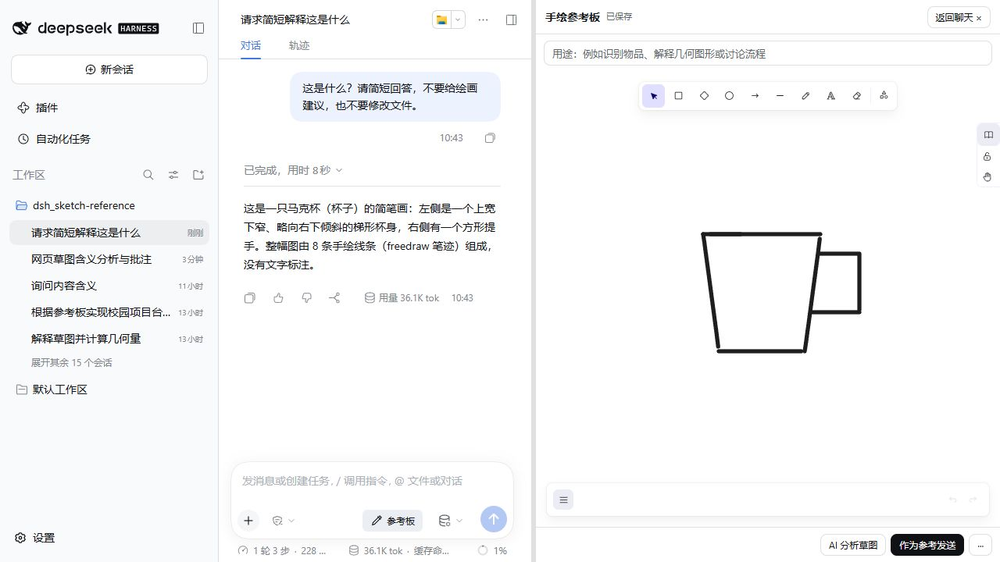
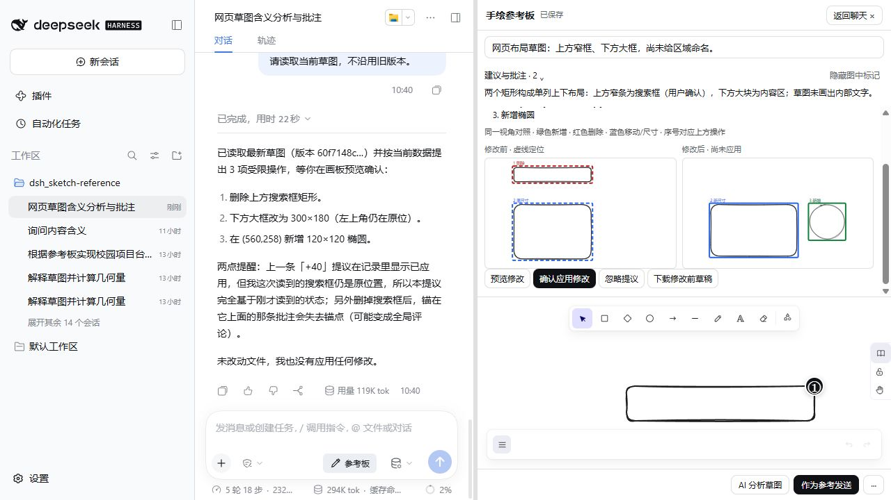

# 0.4.0：围绕批注继续原生对话

基于 main `73ec45e`（0.3.3），保持 DSH `0.2.1-alpha.1`、Excalidraw `0.18.1` 和现有依赖。无协议迁移，无独立聊天界面，无自动发送或模型意图分类。

## 已实现

- 原生会话内容工厂依赖不同的 CSS Module 根选择器，插件壳层曾使 composer 变成 static。现在仅在插件 `.chat` 内、非原生 composer overlay 的活动会话中恢复对应 flex/sticky 规则，保留工具卡片与原生输入行为。
- Agent 工具说明按用户实际问题处理识别、解释、开发、纠正和修改。普通问答不要求批注，不强制三条建议。自由笔迹仍使用真实图片。
- 摘要持续可见且高度受限，详情可折叠，图中标记独立开关。整卡非交互区域可点击，标题使用原生 button 支持键盘；内部动作不会重复切换卡片。
- 复用元素 ID、`getCommonBounds`、`sceneCoordsToViewportCoords` 和既有覆盖层高亮；点击定位使用 `scrollToContent`。高亮不调用 `updateScene`、不保存草图、不调用模型。
- 「追问 / 纠正 / 修改这里」复用 nonce/MessagePort 原生 Composer 桥。宿主重新读取批次、场景、revision 和真实元素，拒绝过期或删除锚点。只插入有长度限制的自然文本，不插入场景 JSON、Base64 或调试信息。折叠原生选区后执行带 draft revision 的插入，保留原文字、引用和附件；不发送消息。
- 修改提议复用既有操作、CAS、恢复备份、确认及原生撤销。`exportToSvg` 渲染修改前后，`getCommonBounds` 统一视角，使用编号及颜色区分新增、删除、移动和尺寸变化；正式画板直到用户确认才改变。支持删除后空图的预览。
- 保存稳定 500ms 后缓存当前合法范围的 PNG；关闭画板或从批注回到聊天时加入同一缓存任务。有效同版本图片直接复用，过程不调用模型、不注入每轮聊天。用户设置重点仍优先，过期重点不回退整图。导出失败保留草图和手动更新入口。
- 根据真实 DS 复合修改错误补充操作精确字段及 `expectedProposalId` 说明，已完成或忽略的记录也必须使用最新 ID。

## 使用与演示

1. 随手画图，返回原生聊天，直接提问。
2. 需要定位说明时明确要求批注，打开参考板查看摘要和编号。
3. 点击整张卡片定位；选择追问、纠正或修改，补充原生输入框中的文字并手动发送。
4. Agent 提出修改后查看同视角前后对照，确认才应用；需要时使用原生撤销。

## 验证与边界

实际执行和模型用量见 [Windows 验证记录](windows-validation-v0.4.0-20261010.md)。不将新单案例外推为所有模型、浏览器或任务全部通过。既有自由笔迹恢复、重点边界、三模式分析、CAS、失败恢复及消息端口清理单测保留。

独立「AI 分析草图」仍是显式建议生成入口；自然问答入口是原生聊天。已应用提议是历史记录，原生撤销后不代表当前画板仍为提议结果。跨刷新撤销、复杂绑定/分组编辑、其他平台、真实限流与超时、PPT 案例和数学可靠性不在此次完成声明内。按钮飞出/缩回动画继续搁置。

本版本以待审查 PR 交付，最终 GitHub 合并由用户执行；没有正式 Release、npm 发布或比赛提交。
