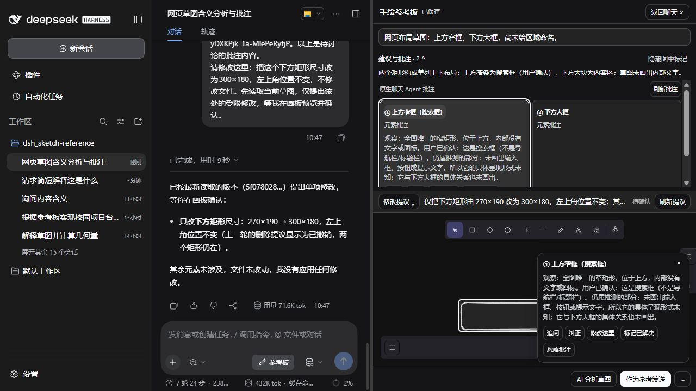
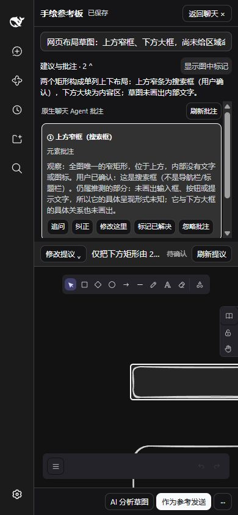

# Windows / 真实 DeepSeek：0.4.0 候选版

日期：2026-10-10（北京时间）。基线 main `73ec45e52e99fdccf0c9e3f983276c6c40f7d863`；本地分支 `codex/v0.4.0-comment-conversation`。最终合并由用户执行。

环境：Windows、Node 24.14.1、pnpm 11.25.0、PowerShell 7；DSH `0.2.1-alpha.1`、Excalidraw `0.18.1`。隔离 profile `sketch-local-check`，官方 DeepSeek-V41-Flash / High。运行目录、凭据、日志和场景原件只在忽略的 `test-results/`；仓库截图仅含本轮自建测试会话。

## 第一阶段：布局与自然问答

复用原生 `conversation.content` 工厂及 composer，检查宿主原版、旧插件、修复插件的 DOM 布局。发现原生内容的根 CSS Module 选择器与插件复制的根类不同，旧插件 composer 计算样式为 static；兼容规则仅在插件活动会话内补齐 flex/sticky，排除已有原生绝对定位 overlay，没有覆盖全局宿主样式。

| 实际状态 | 窗口 | 页面高度 / 视口 | Composer | 结果 |
| --- | --- | --- | --- | --- |
| 旧插件，校园长会话 | 1280×720 | 720 / 720 | static，底部 -824 | 复现输入框离开视口 |
| 禁用插件，同一会话 | 1280×720 | 720 / 720 | sticky，底部 720 | 原生正常 |
| 修复插件，同一会话 | 1280×720 | 720 / 720 | sticky，底部 720 | 打开/关闭画板仍正常 |
| CLI 真正移除插件，自建会话 | 1280×720 | 720 / 720 | sticky，底部 720 | 无参考板按钮，原版基线 |
| CLI 真正移除插件，自建会话 | 390×844 | 844 / 844 | sticky，底部 839 | 无横向页面溢出 |
| 安装 0.4.0，侧栏收起 | 390×844 | 844 / 844 | sticky，底部 844 | 关闭画板恢复原生输入框 |

窄屏独立滚动实测：消息 scroller scrollTop 从 4661 变为 3817，document scrollTop 保持 0，composer 底部保持 844。不同会话、宿主重启和画板关闭/重开均检查过。没有移除原生黄色工具卡；展开原生步骤后仍可查看真实输入、输出及失败原因。没有发现插件新增的重复卡片。

阶段类型检查与 135 项旧单测通过，构建/打包后安装验证。自然问答优化仅改既有工具说明；未增加模型分类、额外聊天系统或每轮图片注入。

## 第二阶段：摘要、卡片、画板联动

复用批注存储、真实 elementId、Excalidraw 公共边界和坐标转换 API、现有 DOM 覆盖层。实测：

- 摘要在详情折叠或隐藏图中标记后仍可见；详情区域自身滚动。
- 整卡的状态文字和空白边距可点击，标题 Enter / Space 可切换。
- 已解决 / 重新打开按钮单独执行，不额外折叠卡片。
- 卡片定位到真实元素，高亮框宽 280 / 高 60 对应 270×50 的元素加 5px 外边距，pointer-events 为 none。
- 点击画板编号②激活第二张卡片；没有改变原生绘图选区。
- 深色主题及 390×844 单列卡片可用；画板宽 334，body scrollWidth 334；默认主题和窗口尺寸在测试后恢复。
- 连续空白区域点击、键盘切换、元素定位和编号切换前后，草图存储对象及视觉缓存对象逐字段一致，revision 均为 `5f078028-8b2a-40d9-9a90-92fe7a6192e4`。原生模型轮次/步骤计数也未增加。

鼠标进入与键盘聚焦共用轻量高亮状态；未做鼠标悬停延迟或高频拖动的性能基准，不能据此声称任意规模无性能回退。

## 第三阶段：批注进入原生聊天

复用 nonce、MessagePort、原生 captureInsertion / insertText / persistDraft；宿主重新校验会话身份、批次、revision、摘要、用途、忽略状态及锚点。新增 6 项单测覆盖三个意图、过期/删除/忽略拒绝、严格桥消息、保留选区和 CAS 失败。

真实验证：

- 先在原生输入框输入「请保持回答简短。」并全选，点击追问后原文字保留，追加当前批注、revision 和真实元素 ID；没有自动发送。由测试人员点击原生发送，DS 解释观察与推测的区别。
- 「纠正」插入可编辑占位，补充「这是搜索框，不是导航栏，请更新这条批注并保留下方批注」后手动发送。DS 使用真实 sketch_annotate 更新批注，下方批注保留，两个图形与 revision 未改变。
- 「修改这里」插入目标元素和受限提议要求，手动发送后进入真实提议流程。
- 同一输入框已有 PNG 待发送附件和未发送文字时，插入追问后两者保留，模型轮次仍为 7（该会话），没有自动发送。
- 切换到另一测试会话没有串入旧批注文本；返回后原文字草稿恢复。**待发送 PNG 在会话切换后未恢复**：当前固定宿主源码在 session input shell dispose 时释放本地附件，文字草稿单独恢复。本轮未进一步做无插件附件切换 A/B，因此不把归因结论视为完成，也不承诺附件跨会话恢复；本轮批注插入当下保留附件已实测。

旧用途变更后，卡片及弹出详情的三个聊天动作全部禁用；宿主校验仍是最终保护。桥接失败、会话中途变化由已有端口清理、超时和新校验单测覆盖，没有在真实浏览器中注入网络/端口故障。

## 第四阶段：受限修改和视觉缓存

复用 `buildEditElements`、`validateEditScene`、提议 CAS、备份与用户确认流程。预览只使用原生 SVG 导出和公共 bounds，不写正式场景。

移动闭环的独立存储快照：

| 阶段 | 搜索框 x | revision | 提议状态 |
| --- | --- | --- | --- |
| 预览前及预览后 | 214 | `9082bfad-07c8-48fe-9b8e-f20e2f163771` | pending |
| 用户确认后 | 254 | `d3d12e9f-7287-4bca-9d02-7fa7c84c1ce1` | applied |
| Excalidraw 原生撤销后 | 214 | `60f7148c-ff44-40c5-a882-690dd6ca14b1` | applied 历史记录 |

y=128、尺寸 270×50、下方图形均保持原值。新增椭圆、删除搜索框、调整下方矩形尺寸的复合预览用红/绿/蓝及编号正确区分，未确认并已忽略。删除全部两个矩形生成相同视角空白结果，未应用。预览后改变用途立即禁用确认与预览，不能用旧提议覆盖新版本。

自动视觉缓存：8 条真实 freedraw 笔迹画出杯身与把手，无用途命名，直接关闭画板并在原生聊天提问。没有点击「更新视觉参考」或「AI 分析草图」，Agent 真实调用 summary 和 read_image 识别杯子，无批注写入、无场景变化。有效同版本缓存复用由策略测试及 UI 操作前后存储对象一致验证；未记录 HTTP 上传字节或严格首屏延迟。

自动缓存保留已有重点边界：有效重点只导出重点，过期重点停止，不能回退全图。新增策略单测覆盖上述情形；本轮未重复全部真实重点场景，既有重点/恢复/三模式单测仍通过。关闭画板等待保存/缓存时冻结编辑，避免等待期间产生新的未保存笔迹；缓存失败不删除草图，可手动更新。

## 真实模型台账

此前 27/30 为历史额度。本轮用户明确放开 DS 次数限制，以下为本次界面发起的实际对话；Agent 内部步骤和工具失败单独记录。用时、Token 取 DSH UI，**Token 包含输入及缓存，不是生成量、账单或 Token 节省对照**。

| 次数 | 场景 | UI 用时 | UI Token | 工具调用 / 结果 |
| --- | --- | --- | --- | --- |
| 1 | 网页两框理解并请求两条批注 | 13s | 49.2K | summary、elements、annotate，3 次成功 |
| 2 | 从批注追问依据 | 4s | 13.6K | 无草图工具，依据已有上下文回答 |
| 3 | 纠正搜索框、更新两条批注 | 14s | 60.9K | summary + annotate；首次 annotate 错加 expectedProposalId 被拒，去掉后成功，共 3 次 |
| 4 | 从批注右移 40 | 8s | 50.9K | elements、propose_edit，2 次成功；应用/撤销另由用户 UI 执行 |
| 5 | 删除 / 尺寸 / 新增复合提议 | 22s | 119K | 2 次读取、3 次提议尝试；多传 resize x/y 及错误 CAS ID 各失败一次，最终成功 |
| 6 | 自由笔迹杯子识别 | 8s | 36.1K | summary、read_image，2 次成功，不生成建议/批注 |
| 7 | 删除全部元素，只预览 | 9s | 67.2K | 最终 UI 为 3 内部步骤，无失败提示，真实 pending 两项删除 |
| 8 | 最终工具说明下尺寸修改 | 9s | 71.6K | elements、propose_edit，2 次成功，无重试 |
| 9 | 最终工具说明下纠正为站内搜索 | 11s | 77.1K | summary、annotate，2 次成功，无重试；批注更新且草图 revision 不变 |

9 次累计：两个会话的 UI 分别 8 轮 / 27 步、1 轮 / 3 步；观察到 3 次工具协议拒绝及同轮重试，没有观察到模型网络自动重试。基于实际错误补充 annotate 精确字段、每种编辑操作的精确键及所有状态的最新 proposal ID 用法，最后两次针对性复测均一次成功。DS 对历史 applied / dismissed 状态的文字说明仍可能不精确，以当前场景读取和 UI 状态为准。

## 工程验证与尚未覆盖范围

- 最新 `pnpm run typecheck` 通过，`pnpm test` 16 文件 / 142 项通过，保留原有 135 项。
- 完整 bundle、pack 成功。一次 esbuild 无法删除系统 TEMP 临时文件，改用仅本构建进程的工作区 TEMP 后成功；未修改系统环境配置。许可证生成的 Windows 路径差异已恢复，不提交无关许可证变动。
- CodeRabbit CLI 不可用，采用直接 diff 审阅，未声称有 CodeRabbit 审查结果。审阅补上了关闭画板等待缓存期间冻结编辑的保护。
- 本轮浏览器验证通过实际 CUA 操作安装后的 DSH；没有运行仓库旧 Playwright fixture 脚本，不把旧脚本模型结果当成真实 DeepSeek。
- 仍未覆盖：全部缩放/DPI/多浏览器/其他插件组合、真实 429/超时/掉线、全部桥接失败注入、长期内存资源基准、独立分析三模式全量重新验收、附件跨会话恢复归因、PPT 案例与数学正确性。

因此结论是 **0.4.0 核心交互闭环已有实际代码与真实 DS 验证，可以审查合并；不是所有历史验收项或所有边界全部完成**。没有正式 Release、npm 发布、比赛提交或代用户合并。
