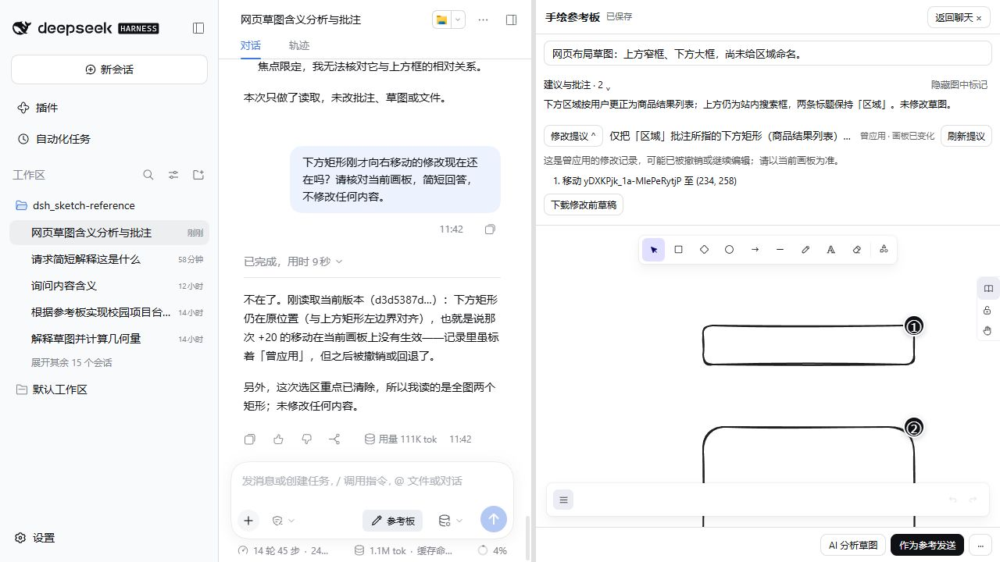

# Windows v0.4.1 验证记录（2026-10-10）

## 范围与环境

基线 main `9bcad5f`；Windows、Node `24.14.1`、pnpm `11.25.0`、固定 DSH `0.2.1-alpha.1`、Excalidraw `0.18.1`。使用隔离 profile `sketch-local-check`，浏览器通过实际页面交互操作。场景为两个空矩形和已有自由手绘物品会话；未改用户其他 profile。卸载、重装、重启前保存四张插件存储表备份。

真实模型使用宿主现有官方 DeepSeek-V41-Flash / High 配置。本轮调用与 0.4.0 历史账目分开，见下表；未记录或公开密钥、鉴权 URL、Base64 或完整会话存储。

## 自动检查

`pnpm run typecheck`、`pnpm test`、`pnpm run bundle`、`pnpm pack` 均通过。保留原有 142 项测试，增加 6 项，共 17 文件、148 项通过。

新增覆盖：自然短文本、同标题与相似旧 UUID 的精确区分、Agent/分析来源、过期/会话变化/忽略/删除/重点越界/歧义拒绝、现有工具解析且不写场景、历史分析批注兼容、提议各状态与撤销后文案、Agent 历史应用语义。

既有原生生命周期、视觉和修改测试继续通过，包含视角/选择变化不产生场景写入、导出任务及相同快照复用、失败后可重试、focus 边界、缓存版本校验、CAS 和失败恢复。没有删除测试或升级依赖。原有直接 Playwright 浏览器脚本本轮未执行，以安装后真实浏览器操作回归代替。

## 安装后的实际回归

| 路径 | 观察结果 |
| --- | --- |
| 两条批注均命名“区域”，追问第二条 | Agent 使用短引用调用现有 `sketch_read`，回答准确指向下方矩形，不按相同标题猜测 |
| 纠正第二条为商品结果列表 | 原有 `sketch_annotate` 更新下方正文，两条标题和真实锚点、另一条正文保留；场景未变 |
| 第二条“修改这里” | 新批次生成新引用；真实 Agent 读取引用、元素，再提出单项向右移动 20 的修改 |
| 预览 → 确认 → 撤销 | 预览前后草图和视觉缓存存储完全相同；确认后下方 x 214→234，上方不变；原生撤销后 x 恢复 214，保存为新 revision；提议仍为历史 applied |
| 提议状态 | 待预览、已预览待确认、历史应用与撤销后“曾应用 · 画板已变化”可见；待确认时正式草图未变 |
| 原生输入保留 | 先输入“请简短回答。”、加入 PNG、全选文字，再点追问；文字和 PNG 保留，短文本追加；轮次未增加、没有自动发送。之后主动移除测试 PNG 再发送 |
| 操作反馈 | 实际观察到“正在打开聊天…”及动作禁用；增加同步 ref 防止同帧重复进入。失败继续使用已有提示/可重试路径 |
| 卡片和按钮 | 点击卡片非按钮标签区域展开；标题 Enter/Space；内部解决/重开不收起卡片；标记与卡片联动；隐藏标记时摘要及详情仍可见 |
| 关闭重开/会话/重启 | 两个自建测试会话切换，批注与原生输入归属正常；卸载重启和重装重启可恢复草图、批注及历史记录 |

后一个截图来自最终代码安装重启后：历史记录和 Agent 对实际坐标的回答同时可见。回归中曾发现旧成功提示“修改已应用并保存”会持续保留，最终包已改成“本次修改曾应用并保存；可用原生撤销，当前状态以画板为准。”。

## 布局与附件 A/B

完全移除插件并重启作为原生组；安装补丁并重启作为插件组。均使用同一隔离宿主、相同两个会话、相同未发送文字和同一 PNG。

- 两组均在切换到另一会话再返回后恢复文字、丢失 PNG；插入批注当下仍保留 PNG。因此本轮不修改 DSH 附件管理。
- 1280×720：原生和插件聊天消息容器高度 644，长消息内容独立滚动；实际 composer sticky 祖先底边均为 720，页面 scrollY 为 0。`data-slot=conversation.composer` 自身是 display:contents，测量其零尺寸不能代表输入框漂移。
- 调整聊天/画板 separator 两个方向，打开、关闭参考板后输入保持定位。390×844 时两组 body 均为 390×844、页面 scrollX/scrollY 为 0；插件返回聊天后 composer 底边 844，原生组位于视口内（839）。窄屏参考板使用原有单板布局。
- 完全卸载重启后参考板入口为 0，宿主没有插件设置的 inline overflow:clip 容器。保留正常原生工具卡片，可展开查看 `sketch_read` 和其他真实工具步骤。

## 视觉缓存与性能边界

批注展开/定位、解决再重开、标记开关及分栏/窄屏操作前后，过滤当前会话的草图与视觉存储对象完全相同，revision 不变；聊天轮数不变。确认和撤销则分别生成新 revision，视觉记录跟随对应已保存版本。

设置下方矩形为 1 元素重点后准备 focus 缓存，关闭参考板，真实 Agent 成功读取对应 334×254 PNG，仅包含该矩形；没有回退整图。全图与重点记录分别保留。不增加后台模型请求。

本轮没有浏览器级 PNG 导出计数器或性能追踪，因此不把存储相等说成“每次 UI 操作绝对零导出”，不宣称 Token 节省、固定延迟改善或压力性能提升。快速持续绘图/大场景压力、导出竞争主要由既有确定性测试覆盖，未完成持续实机压力测量；未发现足以修改缓存算法的实测证据。

## 真实 DeepSeek 账目

下列耗时和 tok 来自 DSH 每轮界面显示，tok 为宿主整轮用量（包含其上下文/步骤），不是新增插件文本的 Token 成本；不推算价格或节省比例。

| 请求 | 界面耗时 | 界面 tok | 工具次数/结果 |
| --- | ---: | ---: | --- |
| 准备同名批注 | 10 秒 | 82.4K | 3 内部步骤；两条标题及锚点保存成功 |
| 第二条追问 | 6 秒 | 57.2K | 1 次 `sketch_read`，准确下方目标 |
| 第二条纠正 | 7 秒 | 59.6K | 1 次 `sketch_annotate`，正确保留另一条 |
| 第二条修改 | 12 秒 | 126K | 2 次 `sketch_read` + 1 次 `sketch_propose_edit`，未自动应用 |
| 关闭参考板后的重点视觉读取 | 16 秒 | 135K | 首次 focus summary 缺 revision 被拒；随后 2 次合法 `sketch_read` + 1 次 `sketch_read_image` 成功，未越界 |
| 最终包：核对撤销后的实际状态 | 9 秒 | 111K | 2 次 `sketch_read`；识别下方 x=214、移动已不在当前场景，明确区分历史 applied |

共 6 次界面请求。第 5 次中有 1 次真实参数校验失败，模型自行改为先读摘要再读取重点，正常原生错误卡片保留。没有放松 focus/revision 保护来提高成功率。正常 UI 操作未发起模型请求；人工点击原生发送才产生上述轮次。不把内部模型步骤当作用户界面请求数。

## 未覆盖与已知限制

仅验证固定 Windows/DSH 版本和一个浏览器环境；不代表所有模型、宿主版本或任务均正确。输入桥失败、旧批注/无效锚点、重点越界及歧义主要由单元测试覆盖，未对每种错误都注入浏览器故障。focus 参数仍可能被模型首次漏填，已记录自行恢复的实测路径，不宣称工具调用零错误。没有新增画板元素悬停反向命中；理由见补丁说明。没有重写撤销历史、附件恢复或视觉缓存，也不承诺刷新后仍保留 Excalidraw 撤销栈。
